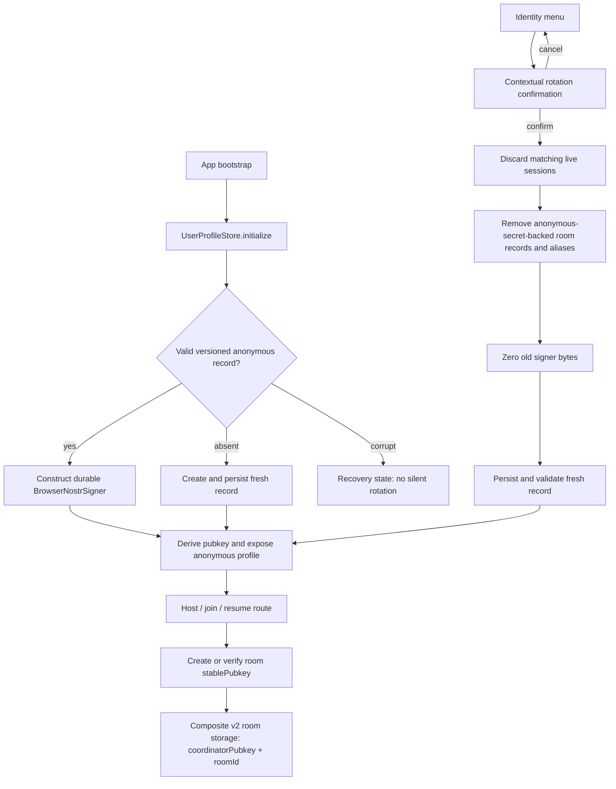

# Phase 15: Identity Continuity & Membership Integrity - Research

**Researched:** 2026-08-02
**Domain:** Browser-local anonymous Nostr signing identity, room-membership lifecycle, and localStorage reconciliation
**Confidence:** HIGH

<user_constraints>
## User Constraints (from CONTEXT.md)

### Locked Decisions

### Durable anonymous identity
- Store one versioned, strictly validated 32-byte anonymous secret locally and derive its public key; do not reuse the coordinator key as the user's anonymous identity.
- `UserProfileStore` owns and exposes the durable anonymous signer while the active method is anonymous.
- Preserve the existing persisted anonymous display name/profile configuration separately from signing material.
- Corrupt persisted identity material fails closed into an explicit recovery/rotation path; it must not silently rotate on reload.

### Room authority
- Newly hosted and joined anonymous rooms use the durable anonymous signer and immutable `stablePubkey` rather than generating unrelated room identities.
- Any reconstructed signer must derive exactly the stored room `stablePubkey` before a session can attach or send.
- Authenticated NIP-07/NIP-46 signers remain isolated from anonymous credential storage and rotation.

### Identity rotation
- Rotation is available only for the anonymous/local identity and requires a contextual confirmation explaining that room memberships on this device will not carry over.
- On confirmation, tear down matching in-memory sessions and remove anonymous room records/credentials before persisting and exposing the fresh signer.
- Rotation removes local room membership state but does not delete the coordinator's hosted group data for other participants.
- After rotation, the new identity must receive or redeem a new invite before sending to any prior room.

### Reconciliation and migration
- `(coordinatorPubkey, roomId)` is the sole room identity for lookup, grouping, removal, and migration. Never merge by title, origin, or room ID alone.
- Prefer verified current v2 storage records and remove legacy aliases only after the target write can be read back and proven to represent the same composite room.
- Do not choose an arbitrary legacy per-room key as the new global identity when stored rooms contain multiple old pubkeys.
- Legacy records remain isolated during migration; rotation removes all anonymous-secret-backed local memberships so old credentials cannot outlive the privacy boundary.

### the agent's Discretion
- Exact storage module/file naming, version number, and validation helper organization.
- Whether signer zeroization is implemented on `BrowserNostrSigner` or in a dedicated anonymous-identity manager, provided old secret buffers are destroyed before the new identity becomes active.
- Exact confirmation-dialog copy and visual treatment, consistent with existing destructive/privacy confirmations.

### Deferred Ideas (OUT OF SCOPE)
- Passphrase-protecting the device-local anonymous identity.
- Restoring historical room access after deliberate rotation.
- Persisting or auto-restoring NIP-46 sessions.
</user_constraints>

<phase_requirements>
## Phase Requirements

| ID | Description | Research Support |
|----|-------------|------------------|
| IDEN-01 | An anonymous identity, including its signing key and local profile, survives ordinary page reloads and browser restarts on the same device. | Versioned validated local record, one `BrowserNostrSigner`, and bootstrap-before-route attachment. |
| IDEN-02 | An anonymous user can deliberately rotate to a fresh identity from the identity menu after a confirmation that explains the room-membership consequences. | Accessible destructive confirmation modeled on `RoomRemovalDialog.svelte`; rotation is anonymous-only. |
| IDEN-03 | Rotating an anonymous identity retires the old identity's active room credentials locally so the new identity cannot send to rooms it has not joined. | Session teardown registry, room-record scan/removal, signer zeroization, and a fresh signer only after cleanup. |
| IDEN-04 | Reloading or restarting an ephemeral host does not create duplicate coordinator or room entries for participants; stored sessions are keyed and reconciled by stable coordinator and room identities. | Current v2 composite key/migration helpers; extend their verification and never infer global identity from room secrets. |
</phase_requirements>

## Project Constraints (from AGENTS.md)

- Preserve unrelated working-tree changes; this is a shared checkout. [VERIFIED: AGENTS.md]
- Use Svelte 5 runes, strict TypeScript, browser-safe APIs, and existing component/state patterns; introduce no Node-only runtime dependency. [VERIFIED: AGENTS.md]
- Do not place private keys, invite secrets, or decrypted message material in logs, errors, snapshots, fixtures, or commits. [VERIFIED: AGENTS.md]
- Use `apply_patch` for deliberate edits. [VERIFIED: AGENTS.md]
- Keep the GSD requirement-to-evidence trail, plan/check before implementation, add or update tests, and run proportional checks before verification. [VERIFIED: AGENTS.md]
- Final project gates are `pnpm lint`, `pnpm exec tsc --noEmit`, `pnpm test`, `pnpm test:e2e`, `pnpm build`, and `git diff --check`. [VERIFIED: AGENTS.md]

## Summary

The phase should introduce one small, versioned anonymous-identity persistence boundary and make `UserProfileStore` its sole runtime owner. The record contains only a strictly validated 32-byte secret encoding plus a version; display name remains in the existing configuration record. On bootstrap, deserialize, validate, construct `BrowserNostrSigner`, derive the pubkey, then set the anonymous profile before route work begins. The current app instead initializes anonymous presentation from the coordinator pubkey, and anonymous room creation generates/persists a separate secret for each room. [VERIFIED: codebase graph and `src/App.svelte`, `src/identity/user-profile.svelte.ts`, `src/components/ChatRoute.svelte`, `src/chat/room-store.ts`]

Identity rotation must be an ordered local transaction: block/tear down live anonymous sessions, delete every anonymous-secret-backed room record and matching aliases, zero old secret bytes, persist and validate the fresh identity record, then expose the fresh anonymous signer/profile. This preserves the requested privacy boundary; it does not call coordinator deletion APIs and it leaves group data for other participants intact. [VERIFIED: 15-CONTEXT.md; VERIFIED: codebase graph]

The room-store already has the correct durable lookup key: v2 keys encode `(coordinatorPubkey, roomId)`, `listRooms` groups with that pair, and migration writes then re-reads before deleting matching aliases. Preserve this design and make the migration/rotation scanners exhaustive over prefixed storage keys; never select a room's historical secret as the device identity. [VERIFIED: codebase graph]

**Primary recommendation:** Add a browser-only anonymous identity manager behind `UserProfileStore`, route all anonymous host/join/resume paths through its signer, and make confirmed rotation a teardown-and-purge transaction before creating the replacement identity. [VERIFIED: 15-CONTEXT.md; VERIFIED: codebase graph]

## Architectural Responsibility Map

| Capability | Primary Tier | Secondary Tier | Rationale |
|------------|-------------|----------------|-----------|
| Generate, validate, persist, and rotate device-local anonymous secret | Browser / Client | — | The product is browser-resident and the secret must never leave the device. [VERIFIED: AGENTS.md; VERIFIED: 15-CONTEXT.md] |
| Expose active anonymous signer and profile state | Browser / Client | — | `UserProfileStore` is the existing Svelte-runes identity state owner. [VERIFIED: codebase graph] |
| Create MLS key packages and join requests using the durable signer | Browser / Client | API / Backend (coordinator protocol) | The browser owns the signer; coordinator calls only carry the public key package/request. [VERIFIED: codebase graph] |
| Persist/reconcile room records and remove local membership credentials | Browser / Client | — | `room-store.ts` already reads/writes browser localStorage and owns composite room keys. [VERIFIED: codebase graph] |
| Delete hosted group data for all participants | API / Backend (coordinator protocol) | Browser / Client | Explicitly out of rotation scope; only the existing host-delete flow performs this remote action. [VERIFIED: 15-CONTEXT.md; VERIFIED: codebase graph] |
| Render rotation affordance and confirmed consequence dialog | Browser / Client | — | The identity menu and accessible room-removal dialog are Svelte components. [VERIFIED: codebase graph] |

## Standard Stack

### Core

| Library / module | Version | Purpose | Why Standard |
|------------------|---------|---------|--------------|
| Existing `nostr-tools` | `2.23.5` pinned | Generate a secret, deterministically derive its pubkey, and sign Nostr events. | Existing browser signer already uses it; upstream documents secret generation as `Uint8Array` and pubkey derivation from that key. [VERIFIED: `package.json`; CITED: https://github.com/nbd-wtf/nostr-tools] |
| Existing `BrowserNostrSigner` | project module | Browser-safe `NostrSigner` bridge for event signing and NIP-44 operations. | Reuse it after adding destruction/validation rather than parallel signer implementations. [VERIFIED: codebase graph] |
| Existing Svelte runes store | Svelte `5.56.3` pinned | Reactive identity state and initialization gate. | `UserProfileStore` already owns anonymous/NIP-07/NIP-46 state and uses `$state`. [VERIFIED: `package.json`; VERIFIED: codebase graph] |
| Existing room store | project module | Composite room identity, local record validation, v2 migration, and session lifecycle. | The existing v2 helper is the authoritative persistence seam. [VERIFIED: codebase graph] |

### Supporting

| Library / module | Version | Purpose | When to Use |
|------------------|---------|---------|-------------|
| Vitest | `4.1.9` pinned | Unit tests for identity-record parsing, rotation ordering, and composite reconciliation. | Use for all deterministic localStorage and signer tests. [VERIFIED: `package.json`; VERIFIED: `vite.config.ts`] |
| Playwright | `1.61.0` pinned | Browser proof for reload, visible dialog consequences, and access loss after rotation. | Use for user-facing lifecycle assertions. [VERIFIED: `package.json`; VERIFIED: `playwright.config.ts`] |
| `RoomRemovalDialog.svelte` pattern | project component | `HTMLDialogElement`, focus, busy state, cancel/confirm semantics. | Adapt its accessibility/lifecycle behavior for privacy rotation confirmation. [VERIFIED: codebase graph] |

### Alternatives Considered

| Instead of | Could Use | Tradeoff |
|------------|-----------|----------|
| One durable local anonymous signer | Per-room anonymous secrets | Per-room keys cause profile changes and reloads to fragment membership; locked context rejects this design. [VERIFIED: 15-CONTEXT.md; VERIFIED: codebase graph] |
| Existing localStorage record | New IndexedDB or encrypted persistence layer | This phase is a continuity repair, and passphrase protection is explicitly deferred. [VERIFIED: 15-CONTEXT.md] |
| Existing `BrowserNostrSigner` | New Nostr signing package | Duplicates well-tested signing/NIP-44 behavior and violates the no-new-dependency recommendation. [VERIFIED: codebase graph; VERIFIED: AGENTS.md] |

**Installation:** None. This phase adds no external package; it uses pinned project dependencies and project modules. [VERIFIED: `package.json`; VERIFIED: 15-CONTEXT.md]

## Package Legitimacy Audit

Not applicable: the recommended plan installs no package. `nostr-tools` and Svelte are already pinned project dependencies; no dependency upgrade is part of the phase. [VERIFIED: `package.json`; VERIFIED: 15-CONTEXT.md]

## Architecture Patterns

### System Architecture Diagram



### Recommended Project Structure

```text
src/
├── identity/
│   ├── anonymous-identity.ts         # versioned record, validation, signer lifecycle/zeroization
│   └── user-profile.svelte.ts        # owns active anonymous signer and authenticated isolation
├── chat/
│   └── room-store.ts                 # composite keys, signer/pubkey verification, exhaustive membership purge
├── components/
│   ├── UserProfile.svelte            # anonymous rotate action and confirmation surface
│   └── ChatRoute.svelte               # attach only a verified signer; registers active-session teardown
└── App.svelte                         # bootstrap identity before workspace routes
```

### Pattern 1: Versioned validate-then-construct identity record

**What:** Parse unknown localStorage JSON into a narrow `AnonymousIdentityRecord`; verify the version and an exact 64-hex-character encoding; decode to exactly 32 bytes; create the signer only after those checks.

**When to use:** App bootstrap and post-rotation persistence verification. A malformed present record must result in a recoverable error state, not replacement-key generation. [VERIFIED: 15-CONTEXT.md]

**Example:**

```typescript
// Source: recommended extension of existing BrowserNostrSigner + validated localStorage patterns.
type AnonymousIdentityRecord = { version: 1; secretKeyHex: string };

function readAnonymousIdentity(raw: string | null): AnonymousIdentityRecord | null {
  if (!raw) return null;
  const value: unknown = JSON.parse(raw);
  if (!isRecord(value) || value.version !== 1 || typeof value.secretKeyHex !== "string") throw new Error("Anonymous identity needs recovery");
  if (!/^[0-9a-f]{64}$/i.test(value.secretKeyHex)) throw new Error("Anonymous identity needs recovery");
  return { version: 1, secretKeyHex: value.secretKeyHex.toLowerCase() };
}
```

The upstream Nostr-tools documentation shows `generateSecretKey()` producing a `Uint8Array` and `getPublicKey(secret)` deriving the matching hex public key; validate the decoded byte length before invoking either signer behavior. [CITED: https://github.com/nbd-wtf/nostr-tools]

### Pattern 2: Verified signer-to-room attachment

**What:** `attach`/`resume` must compare the signer-derived pubkey to the immutable stored `stablePubkey`, including anonymous reconstructed signers.

**When to use:** Every stored-room reload and every fresh anonymous host/join result. Current authenticated resume already compares the two keys, but anonymous stored-room restoration bypasses that check. [VERIFIED: codebase graph]

**Example:**

```typescript
// Source: existing ChatRoute resume guard, applied to all signer modes.
async function requireRoomSigner(room: StoredRoom, signer: NostrSigner): Promise<NostrSigner> {
  if (await signer.getPublicKey() !== room.stablePubkey) {
    throw new Error("This signer does not match the identity that joined this room");
  }
  return signer;
}
```

### Pattern 3: Rotation as ordered teardown, not `setAnonymous`

**What:** Register a synchronous/awaitable teardown callback for live anonymous room sessions. On confirmation, run callbacks, purge matching memberships, zero the old signer, then write/read-back the replacement record and update reactive identity state.

**When to use:** Only anonymous/local rotation. NIP-07 and NIP-46 must not read/write the anonymous secret record or enter this path. [VERIFIED: 15-CONTEXT.md; VERIFIED: codebase graph]

**Anti-Patterns to Avoid**

- **Generate in `ChatRoute.joinAnonymous`:** This creates a new identity per invite and makes the signer/profile non-durable. [VERIFIED: codebase graph]
- **Set a fresh pubkey before removing room records:** Existing session objects can retain/sign with the old material, breaking the privacy boundary. [VERIFIED: 15-CONTEXT.md; VERIFIED: codebase graph]
- **Treat title, origin, or room ID as a room primary key:** Two coordinators can have the same group ID; only the composite key is safe. [VERIFIED: 15-CONTEXT.md; VERIFIED: codebase graph]
- **Delete an alias before read-back verification:** A failed target write would lose the last local membership record. [VERIFIED: 15-CONTEXT.md; VERIFIED: codebase graph]
- **Log parsed identity records or use secret literals in tests:** This leaks private material into browser logs, snapshots, fixtures, or commits. [VERIFIED: AGENTS.md]

## Don't Hand-Roll

| Problem | Don't Build | Use Instead | Why |
|---------|-------------|-------------|-----|
| secp256k1 secret generation and pubkey derivation | Custom random/elliptic-curve code | Existing `nostr-tools` primitives plus `BrowserNostrSigner` | Correct key generation, derivation, event signing, and NIP-44 behavior are already integrated. [VERIFIED: codebase graph; CITED: https://github.com/nbd-wtf/nostr-tools] |
| Nostr signer interface | A second local signer implementation | Extend `BrowserNostrSigner` with destruction or wrap it in the identity manager | Prevents signing/NIP-44 drift across room and profile code. [VERIFIED: codebase graph] |
| Destructive dialog semantics | Ad hoc `confirm()` or a non-modal popover | Existing `RoomRemovalDialog.svelte` lifecycle/accessibility pattern | It already uses modal focus, escape/backdrop behavior, busy state, and confirm error display. [VERIFIED: codebase graph] |
| Room identity keying | Title/URL/string-concatenation ad hoc matching | `roomStorageKey`, `sameRoomIdentity`, and one shared composite helper | Existing helpers preserve coordinator isolation and migration verification. [VERIFIED: codebase graph] |

**Key insight:** The only new code should coordinate existing signing, storage, dialog, and session primitives; do not introduce a second identity system or a new persistence dependency. [VERIFIED: 15-CONTEXT.md; VERIFIED: codebase graph]

## Runtime State Inventory

| Category | Items Found | Action Required |
|----------|-------------|-----------------|
| Stored data | Browser localStorage contains room v2 records, legacy room aliases, active-host room markers, NIP-07 selection marker, configuration/profile values, and will gain one anonymous-identity record. [VERIFIED: codebase graph] | Add a code migration/reconciliation scan; rotation deletes only anonymous-secret-backed memberships and aliases, not display-name config or NIP-07 marker. |
| Live service config | None found for anonymous identity: coordinator group data and invitations are remote protocol state, but the requested rotation must not delete them. [VERIFIED: 15-CONTEXT.md; VERIFIED: codebase graph] | No remote data migration; explicitly avoid coordinator delete calls during rotate. |
| OS-registered state | None — this browser-only phase registers no system service, scheduled task, process manager, or OS credential. [VERIFIED: AGENTS.md; VERIFIED: codebase graph] | None. |
| Secrets/env vars | Anonymous room secrets and the new anonymous identity secret are browser-local; no environment-variable key was found in the phase seams. [VERIFIED: codebase graph] | Do not log/persist secrets outside their intended records; zero old buffers during rotation. |
| Build artifacts | None — no package rename, executable rename, or installed artifact is in scope. [VERIFIED: 15-CONTEXT.md; VERIFIED: `package.json`] | None. |

## Common Pitfalls

### Pitfall 1: Silent identity replacement after corrupt storage

**What goes wrong:** Reload creates a fresh pubkey while old rooms remain, so the user sees cached rooms but cannot prove why sending fails. [VERIFIED: 15-CONTEXT.md]

**Why it happens:** Treating malformed JSON exactly like an absent record loses the distinction between first-run bootstrap and damaged credential state. [VERIFIED: 15-CONTEXT.md]

**How to avoid:** Return distinct `absent` and `corrupt` outcomes; only `absent` can create a key automatically. Show explicit recovery/rotate action for `corrupt`. [VERIFIED: 15-CONTEXT.md]

**Warning signs:** The pubkey/avatar changes after a reload without confirmation, or a room's stored `stablePubkey` no longer matches the active signer. [VERIFIED: 15-CONTEXT.md; VERIFIED: codebase graph]

### Pitfall 2: Room signer mismatch accepted on the anonymous path

**What goes wrong:** A tampered or stale stored room attaches a signer that does not own its immutable member pubkey. [VERIFIED: 15-CONTEXT.md]

**Why it happens:** `signerForStoredRoom` currently constructs from `anonymousSecretKey` without checking its derived pubkey; only the authenticated resume path performs the comparison. [VERIFIED: codebase graph]

**How to avoid:** Centralize `requireRoomSigner` and call it before every attach/send-capable session creation. [VERIFIED: codebase graph]

**Warning signs:** `stablePubkey` differs from `await signer.getPublicKey()`, or a cached room shows connected before this check occurs. [VERIFIED: codebase graph]

### Pitfall 3: Partial rotation allows in-flight writes

**What goes wrong:** A timer or queued operation persists an old room after its local record was removed. [VERIFIED: codebase graph]

**Why it happens:** `ChatRoomSession.stop()` is restartable, while `discard()` is the existing operation that disables subsequent persistence. [VERIFIED: codebase graph]

**How to avoid:** Rotation teardown must call `discard()` on registered matching sessions before scanning/removing storage, and wait for teardown completion before publishing the new signer. [VERIFIED: 15-CONTEXT.md; VERIFIED: codebase graph]

**Warning signs:** `cordn:rooms-changed` is followed by an old room record reappearing, or a rotated user can still send without a new invite. [VERIFIED: codebase graph]

### Pitfall 4: Incomplete alias cleanup or cross-coordinator deletion

**What goes wrong:** A legacy alias survives rotation, or cleanup deletes another coordinator's room with the same `roomId`. [VERIFIED: 15-CONTEXT.md]

**Why it happens:** Addressing only the current v2 key misses aliases; matching by room ID alone loses the coordinator dimension. [VERIFIED: 15-CONTEXT.md; VERIFIED: codebase graph]

**How to avoid:** Scan every room-prefix entry, parse/validate it, and match only both `coordinatorPubkey` and `id`; delete aliases only after composite-identity read-back verification. [VERIFIED: 15-CONTEXT.md; VERIFIED: codebase graph]

### Pitfall 5: Treating localStorage as trusted or confidential

**What goes wrong:** Corrupt injected values affect identity/room behavior, or an XSS/local-machine compromise reads anonymous secrets. [CITED: https://cheatsheetseries.owasp.org/cheatsheets/HTML5_Security_Cheat_Sheet.html]

**How to avoid:** Validate every storage record on read, keep secret-bearing values out of logs, and preserve the deferred passphrase-protection boundary rather than claiming localStorage is a security vault. [VERIFIED: AGENTS.md; VERIFIED: 15-CONTEXT.md; CITED: https://cheatsheetseries.owasp.org/cheatsheets/HTML5_Security_Cheat_Sheet.html]

## Code Examples

Verified/recommended implementation patterns:

### Construct and prove a durable anonymous signer

```typescript
// Source: BrowserNostrSigner derives and exposes a deterministic pubkey.
const record = readAnonymousIdentity(localStorage.getItem(ANONYMOUS_IDENTITY_KEY));
const secret = record ? hexToBytes(record.secretKeyHex) : generateSecretKey();
if (secret.byteLength !== 32) throw new Error("Anonymous identity needs recovery");

const signer = new BrowserNostrSigner(secret);
const pubkey = await signer.getPublicKey();
```

The local signer currently copies bytes and derives its public key in its constructor; add a `destroy()` method that fills its private copy and rejects future signing, modeled after `KeyManager.destroy()`. [VERIFIED: codebase graph]

### Purge local anonymous memberships without deleting coordinator groups

```typescript
// Source: recommended orchestration around existing session.discard/removeStoredRoom.
await Promise.all([...anonymousSessionTeardowns].map((teardown) => teardown()));
for (const room of listAnonymousSecretBackedRoomsAndAliases()) {
  removeStoredRoom(room); // composite coordinatorPubkey + id only
}
oldSigner.destroy();
```

The actual scanner must inspect aliases as well as normal `listRooms()` output, because `listRooms()` intentionally returns one reconciled representative per composite identity. [VERIFIED: codebase graph]

## State of the Art

| Old / current behavior | Required phase behavior | Impact |
|------------------------|-------------------------|--------|
| App bootstrap supplies coordinator public key as anonymous presentation identity. [VERIFIED: codebase graph] | Bootstrap a versioned independent device-local anonymous signer before the workspace route initializes. [VERIFIED: 15-CONTEXT.md] | Reload retains the same anonymous pubkey/avatar without an identity flash. [VERIFIED: 15-CONTEXT.md] |
| Anonymous host and join paths generate/persist a per-room secret. [VERIFIED: codebase graph] | Every anonymous host/join uses the one active durable signer and records its immutable pubkey as `stablePubkey`. [VERIFIED: 15-CONTEXT.md] | Membership is stable rather than fragmented by room/reload. [VERIFIED: 15-CONTEXT.md] |
| Stored anonymous signer restoration constructs a signer with no pubkey check. [VERIFIED: codebase graph] | Reconstructed signer must prove it derives the stored `stablePubkey` before attachment/sending. [VERIFIED: 15-CONTEXT.md] | Tampered/stale credential cannot silently become a live session. [VERIFIED: 15-CONTEXT.md] |
| Current v2 storage already favors composite identity and read-back migration. [VERIFIED: codebase graph] | Extend it to exhaustive anonymous membership purge and multi-legacy isolation. [VERIFIED: 15-CONTEXT.md] | Restart/reload cannot multiply or cross-delete rooms. [VERIFIED: 15-CONTEXT.md] |

## Assumptions Log

All material recommendations are locked by `15-CONTEXT.md` or verified against the active codebase and official documentation. No user-confirmation assumption remains. [VERIFIED: 15-CONTEXT.md; VERIFIED: codebase graph]

## Open Questions

None blocking. The only explicitly delegated choices are the storage helper/module naming, signer-zeroization placement, and confirmation copy/visual treatment; choose them to match the project patterns documented above. [VERIFIED: 15-CONTEXT.md]

## Environment Availability

| Dependency | Required By | Available | Version | Fallback |
|------------|-------------|-----------|---------|----------|
| Node.js | Type-check/build/test tooling | ✓ | `v25.2.1` | — [VERIFIED: local environment] |
| pnpm | Project scripts | ✓ | `10.17.1` | — [VERIFIED: local environment] |
| Vitest | Unit validation | ✓ | `4.1.9` | — [VERIFIED: local environment; `package.json`] |
| Playwright | Browser validation | ✓ | `1.61.0` | — [VERIFIED: local environment; `package.json`] |
| Browser localStorage/Web Crypto | Runtime identity persistence and key generation | Required browser platform API | Browser-run validation required | jsdom unit tests plus Playwright proof [VERIFIED: codebase graph] |

**Missing dependencies with no fallback:** None. [VERIFIED: local environment]

**Missing dependencies with fallback:** None. [VERIFIED: local environment]

## Validation Architecture

### Test Framework

| Property | Value |
|----------|-------|
| Framework | Vitest `4.1.9` with jsdom; Playwright `1.61.0`. [VERIFIED: `package.json`; VERIFIED: `vite.config.ts`; VERIFIED: `playwright.config.ts`] |
| Config file | `vite.config.ts` (Vitest); `playwright.config.ts` (browser). [VERIFIED: codebase files] |
| Quick run command | `pnpm exec vitest run tests/unit/user-profile.test.ts tests/unit/room-navigation.test.ts` [VERIFIED: `package.json`] |
| Full suite command | `pnpm test && pnpm test:e2e` [VERIFIED: `package.json`] |

### Phase Requirements → Test Map

| Req ID | Behavior | Test Type | Automated Command | File Exists? |
|--------|----------|-----------|-------------------|--------------|
| IDEN-01 | Valid identity record returns same signer pubkey/profile across new store instances; malformed record enters recovery, not fresh creation. | unit + browser | `pnpm exec vitest run tests/unit/user-profile.test.ts` and `pnpm exec playwright test tests/e2e/nip07-session-restoration.spec.ts` | ✅ existing files; add cases |
| IDEN-02 | Identity menu opens a contextual confirmation; cancel keeps identity, confirm changes pubkey. | browser | `pnpm exec playwright test tests/e2e/nip07-session-restoration.spec.ts` | ✅ existing file; add case |
| IDEN-03 | Confirmed rotation discards sessions/removes all secret-backed local room aliases and fresh identity cannot send to old room. | unit + browser | `pnpm exec vitest run tests/unit/room-navigation.test.ts tests/unit/user-profile.test.ts` and `pnpm exec playwright test tests/e2e/stale-local-sessions.spec.ts` | ✅ existing files; add cases |
| IDEN-04 | Same room ID under distinct coordinator pubkeys remains two records; v2 source wins; aliases only delete after verified composite read-back. | unit + browser | `pnpm exec vitest run tests/unit/room-navigation.test.ts` and `pnpm exec playwright test tests/e2e/stale-local-sessions.spec.ts` | ✅ existing files; extend multi-legacy scenario |

### Sampling Rate

- **Per task commit:** `pnpm exec vitest run tests/unit/user-profile.test.ts tests/unit/room-navigation.test.ts`
- **Per wave merge:** `pnpm lint && pnpm exec tsc --noEmit && pnpm test`
- **Phase gate:** `pnpm lint && pnpm exec tsc --noEmit && pnpm test && pnpm test:e2e && pnpm build && git diff --check`

### Wave 0 Gaps

- [ ] Add anonymous-record parser/rotation tests in `tests/unit/user-profile.test.ts` — covers IDEN-01, IDEN-02, IDEN-03.
- [ ] Add a forged/incorrect anonymous secret-to-`stablePubkey` attachment test plus exhaustive alias purge/multiple-legacy tests in `tests/unit/room-navigation.test.ts` — covers IDEN-03, IDEN-04.
- [ ] Add browser proof for reload stability, dialog cancellation/confirmation, and post-rotation fresh-invite requirement in `tests/e2e/nip07-session-restoration.spec.ts` or a new focused identity spec — covers IDEN-01 through IDEN-03.

## Security Domain

### Applicable ASVS Categories

| ASVS Category | Applies | Standard Control |
|---------------|---------|-----------------|
| V2 Authentication | Partial | Preserve NIP-07/NIP-46 separation; anonymous credential is a local signing identity, not server authentication. [VERIFIED: 15-CONTEXT.md; VERIFIED: codebase graph] |
| V3 Session Management | Yes | Confirmed rotation calls session `discard()`, purges memberships, and prevents old credentials from reattaching. [VERIFIED: 15-CONTEXT.md; VERIFIED: codebase graph] |
| V4 Access Control | Partial | Room send capability remains bound to stored `stablePubkey` and server admission; new identity requires a new invite. [VERIFIED: 15-CONTEXT.md; VERIFIED: codebase graph] |
| V5 Input Validation | Yes | Treat localStorage as untrusted: strict record/version/hex/byte-length validation and signer-pubkey comparison. [VERIFIED: 15-CONTEXT.md; CITED: https://cheatsheetseries.owasp.org/cheatsheets/HTML5_Security_Cheat_Sheet.html] |
| V6 Cryptography | Yes | Use existing `nostr-tools` and `BrowserNostrSigner`; do not implement key generation or elliptic-curve operations manually. [VERIFIED: codebase graph; CITED: https://github.com/nbd-wtf/nostr-tools] |

### Known Threat Patterns for browser-local identity

| Pattern | STRIDE | Standard Mitigation |
|---------|--------|---------------------|
| Malformed/tampered localStorage identity or room record | Tampering | Strict parse/validate; verify signer-derived pubkey equals stored `stablePubkey`; fail closed for identity corruption. [VERIFIED: 15-CONTEXT.md; CITED: https://cheatsheetseries.owasp.org/cheatsheets/HTML5_Security_Cheat_Sheet.html] |
| Old session persists/re-writes removed membership after rotation | Elevation of privilege | Call `discard()` before delete and wait for teardowns before exposing fresh signer. [VERIFIED: 15-CONTEXT.md; VERIFIED: codebase graph] |
| Same `roomId` at a different coordinator is removed/migrated | Tampering | Use only `(coordinatorPubkey, roomId)` identity for read, merge, and remove. [VERIFIED: 15-CONTEXT.md; VERIFIED: codebase graph] |
| Secret disclosure through diagnostic data | Information disclosure | Never log/snapshot/fixture private bytes or raw persisted identity records. [VERIFIED: AGENTS.md] |
| XSS or local user reads browser storage | Information disclosure | Explicitly document local-only credential scope and do not claim localStorage confidentiality; passphrase protection remains deferred. [VERIFIED: 15-CONTEXT.md; CITED: https://cheatsheetseries.owasp.org/cheatsheets/HTML5_Security_Cheat_Sheet.html] |

## Sources

### Primary (HIGH confidence)

- Active codebase graph and focused source inspection — `UserProfileStore`, `BrowserNostrSigner`, `ChatRoomSession`, room composite-storage/migration, `App.svelte`, `ChatRoute.svelte`, `UserProfile.svelte`, and test infrastructure. [VERIFIED: codebase graph]
- `15-CONTEXT.md` — locked requirements, privacy boundary, migration and rotation decisions. [VERIFIED: 15-CONTEXT.md]
- `AGENTS.md`, `package.json`, `vite.config.ts`, and `playwright.config.ts` — project constraints and available validation stack. [VERIFIED: codebase files]

### Secondary (MEDIUM confidence)

- https://github.com/nbd-wtf/nostr-tools — documented secret generation, pubkey derivation, byte/hex conversion, and signing API. [CITED: https://github.com/nbd-wtf/nostr-tools]
- https://svelte.dev/docs/svelte/%24state — Svelte reactive-state documentation consulted; Context7 and `ctx7` CLI were unavailable in this environment. [CITED: https://svelte.dev/docs/svelte/%24state]
- https://cheatsheetseries.owasp.org/cheatsheets/HTML5_Security_Cheat_Sheet.html — browser storage is untrusted and not a confidentiality boundary. [CITED: https://cheatsheetseries.owasp.org/cheatsheets/HTML5_Security_Cheat_Sheet.html]

### Tertiary (LOW confidence)

- None.

## Metadata

**Confidence breakdown:**

- Standard stack: HIGH — no new package is proposed; existing pinned dependencies and active source seams were verified. [VERIFIED: `package.json`; VERIFIED: codebase graph]
- Architecture: HIGH — locked context matches the current identity, session, and composite-storage implementation seams. [VERIFIED: 15-CONTEXT.md; VERIFIED: codebase graph]
- Pitfalls: HIGH — each derives from a locked privacy/migration constraint or directly observable current behavior. [VERIFIED: 15-CONTEXT.md; VERIFIED: codebase graph]

**Research date:** 2026-08-02
**Valid until:** 2026-08-09 (identity/security and dependency documentation should be refreshed before planning after this date). [ASSUMED]
